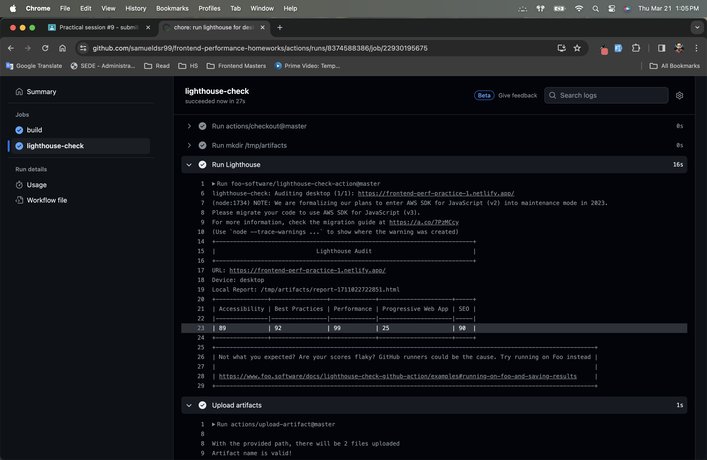
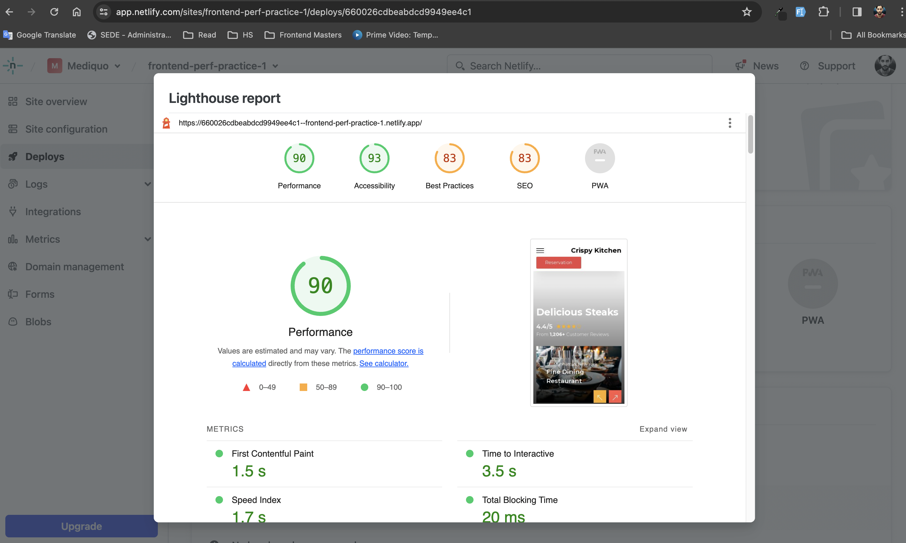

# Practice session #1 for Frontend & API Performance

Optimizations made:

1. Lazy load of images outside of the viewport
2. Minification of assets using vite
3. All images were converted to a next-gen format (webp)
4. Defer JS files
5. Non-blocking load of Google Fonts to reduce render-blocking resources (it increases CLS a bit but it's worth it)

Other stuff:

- Site is deployed in Netlify: https://frontend-perf-practice-1.netlify.app/
- Github Actions for build and deploy
- Lighthouse builstep
- To visualize the bundle analysis, run `npm run build:analyze`

<!-- Image -->

Lightouse report from Github Actions

Lithouse report from Netlify plugin

